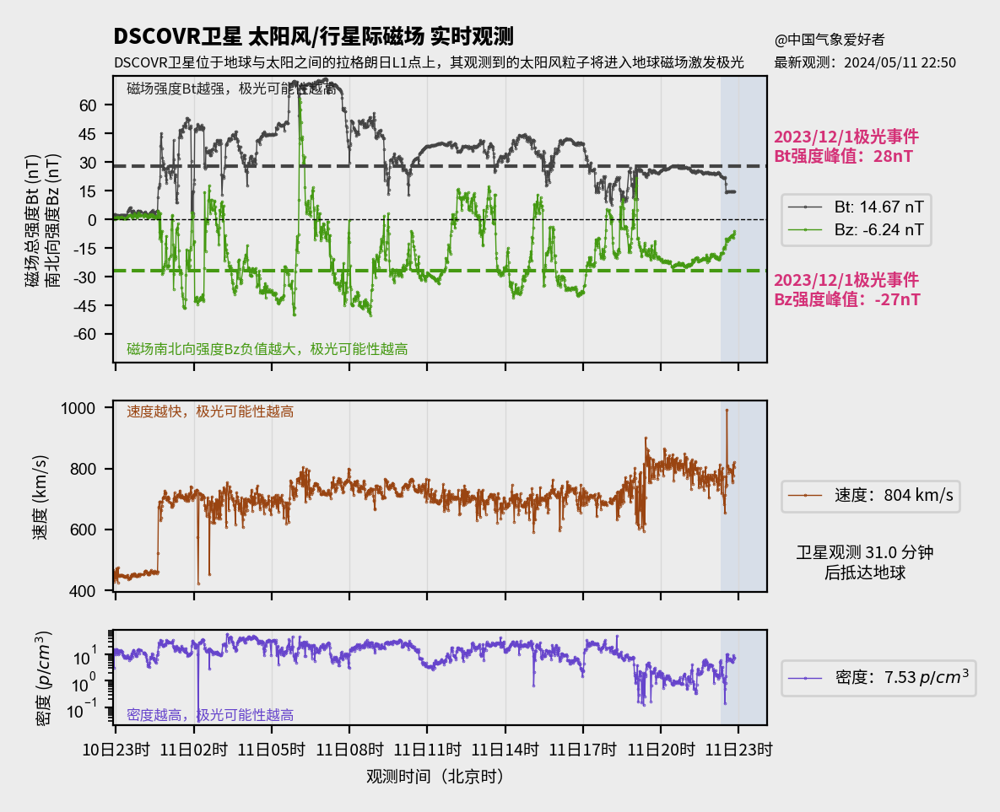

> *神秘北极圈 阿拉斯加的山巅 谁的脸 出现海角的天边* ——《欧若拉》张韵涵

作为一种绚丽的天文现象，**极光**总是引人注目。当来自太阳的高能粒子与被地球磁场引导进入地球大气层，绚丽的极光便在它们与气体分子间的碰撞间产生了。要进行较为精确的极光预报，从各种数据中获取这些粒子与地球磁场的互动情况就显得尤为重要。当太阳活动剧烈时，在我国纬度最高的黑龙江和新疆北部地区有机会看到极光。2024年5月，强烈的太阳活动一度使得可见极光的界限推进到华北地区，北京、秦皇岛、甚至大连的天文爱好者们，都有幸一睹极光的真容。这十余年未见的强烈极光活动也为我们提供了一次难得的机会，探索如何预测极光的出现情况。本文将按极光发生时间顺序，以2024年5月的极光活动为例，介绍极光发展的全过程，并简要的阐述如何利用互联网上公开的各种数据，对极光活动进行预测。

---

## 极光的起源：太阳耀斑与日冕物质抛射

当太阳表面的磁力线发生重组现象时，一些粒子因被磁场束缚，达到极高的温度，同时放出大量X射线辐射，这便是太阳耀斑的由来。由于地球大气会阻挡绝大部分X射线，安置在大气层之外人造卫星上的X射线相机和流量仪是观测太阳耀斑的主要手段。太阳耀斑发生时，卫星图片上会显示出明显的亮区，X射线流量仪所探测到的流量也会显著上升。

实时太阳X射线成像：[SDO卫星](https://solarham.com/sdoimagery.htm) / [GOES卫星](https://solarham.com/goes16.htm)

实时X射线流量：[GOES卫星](https://www.swpc.noaa.gov/products/goes-x-ray-flux)

按照X射线流量的从小到大，耀斑也被分为A、B、C、M和X级，同级别的耀斑中，字母后跟的数字越大，耀斑越强烈。一般来说，高于M2.5级的耀斑就代表着强烈的太阳活动。

耀斑发生的同时，往往伴随着日冕物质抛射（Coronal Mass Ejection， 简称**CME**）。混乱的磁场使得太阳表面的大量的高能粒子逃逸。同时，这些高能粒子也在持续发光，因此可被卫星上的观测太阳周边的日冕仪观测到。当日冕仪上出现了环状的CME图像（Halo CME）时，便表明该次CME朝着地球方向而来，换句话说，极光已经在路上了。

日冕仪图像：[Helioviewer](https://helioviewer.org/)[^选择SOHO-LASCO-Running Difference可以更好观察CME] / [SolarHam](https://solarham.com/lasco.htm)

与X射线不同的是，这些造成极光的高能粒子的速度只有数百至数千公里每秒，远低于光速，**这就为极光的预报争取到了时间**。这些高能粒子流又被称为**太阳风**，以800km/s的太阳风速度为例，从CME产生到抵达地球需要约50小时的时间。

---

## 极光预报与监测：磁场比Kp值更重要

当朝向地球方向的CME出现时，一些空间天气模型会给出预报结果，包括太阳风中的粒子密度，抵达的时间等等。当模型预测**给出较高的太阳风粒子密度**（$>30/cm^3$）时，就可以**考虑出发在我国境内追逐极光**了。实践表明，由于实际CME的规模和速度都难以估计，模型的预测结果只能给出一个大致的参考，一些运气，也是必须的。

太阳风模型预测结果：[NOAA-SWPC](https://www.swpc.noaa.gov/products/wsa-enlil-solar-wind-prediction) / [SolarHam](https://solarham.com/cmetracking.htm)

在高密度太阳风抵达地球附近时，运行在太阳和地球之间拉格朗日L1点的卫星将率先侦测到空间环境的变化。根据太阳风速度的不同，可以提前预知十数分钟至数十分钟后的极光情况。而在卫星观测的各种指标中，**行星际磁场（$B_t$）的南北向分量（$B_N$或$B
_Z$）是最为重要的**。当该指标为**负值**时，来自太阳的行星际磁场将与地球的磁场携手将高能粒子送入大气层中。一般来说，$-20nT$的$B_N$已经可以产生在我国境内可见的红色极光，$-27nT$时黑龙江漠河曾可见绿色极光，而2024年5月的极光事件中，$B_N$一度达到$-50nT$左右，新疆北部可见绚烂的绿色极光。

太阳风实时监测：[NOAA-SWPC](https://www.swpc.noaa.gov/products/real-time-solar-wind) / [SolarHam](https://solarham.com/solarwind.htm)

而大家所熟知**Kp指数**是由地面上的磁力计测得的地磁活动计算所得来的，虽然也与极光活动有一定的正相关，但不如行星际磁场来得直接。另外，NOAA的空间天气中心也利用卫星数据提供了短期内（约30分钟后）的极光预报，但其标出的可见范围比实际的要小，在前往更高纬度地区观测极光时，可参考该模型给出的预报。

NOAA极光预报模型：[NOAA-SWPC](https://www.swpc.noaa.gov/products/aurora-30-minute-forecast)

---

碎碎念：有生之年，一定要去看一次极光！